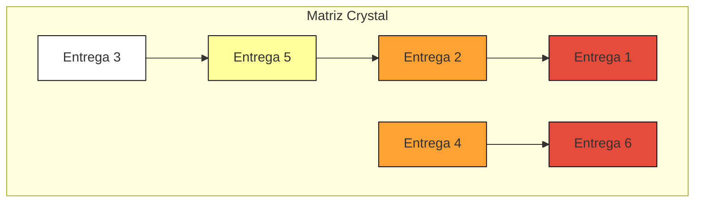

# Gantt-Crystal

```mermaid
graph TD
  subgraph Matriz Crystal
    D8["Entrega 3"]:::branco --> C20["Entrega 5"]:::amarelo --> D80["Entrega 2"]:::laranja --> D100a["Entrega 1"]:::vermelho
    D10["Entrega 4"]:::laranja --> D100b["Entrega 6"]:::vermelho

  end

classDef branco fill:#fff, stroke:#000, stroke-width:1px;
classDef amarelo fill:#FFFF99, stroke:#000, stroke-width:1px;
classDef laranja fill:#FFA233, stroke:#000, stroke-width:1px;
classDef vermelho fill:#E64C3C, stroke:#000, stroke-width:1px;


```
