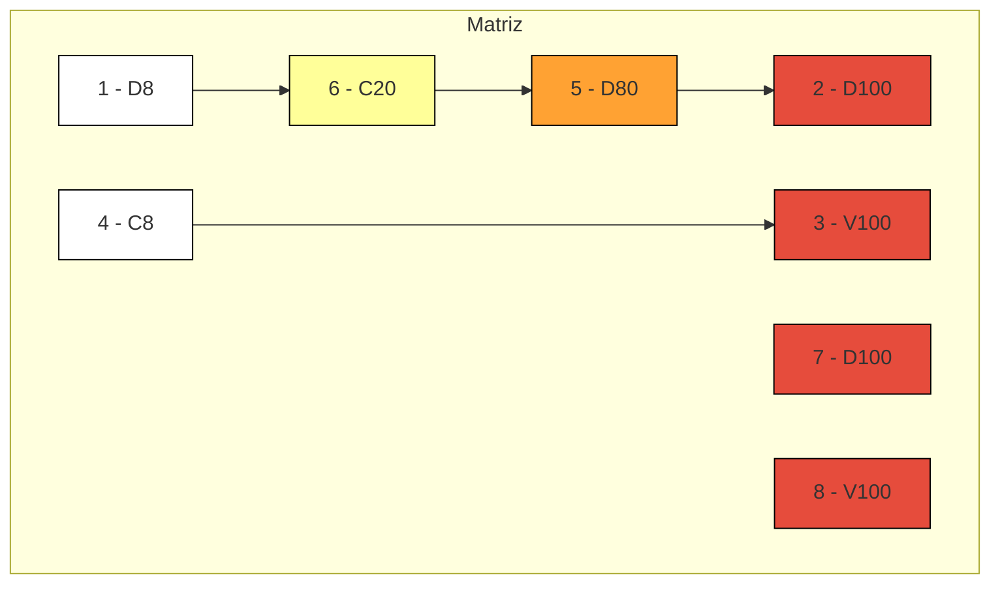

# Gantt-Crystal

```mermaid
graph TD
  subgraph Matriz
    D8["1 - D8"]:::branco --> C20["6 - C20"]:::amarelo --> D80["5 - D80"]:::laranja --> D100a["2 - D100"]:::vermelho
    C8["4 - C8"]:::branco ----> V100["3 - V100"]:::vermelho
    D100b["7 - D100"]:::vermelho
    V100b["8 - V100"]:::vermelho

  end

classDef branco fill:#fff, stroke:#000, stroke-width:1px;
classDef amarelo fill:#FFFF99, stroke:#000, stroke-width:1px;
classDef laranja fill:#FFA233, stroke:#000, stroke-width:1px;
classDef vermelho fill:#E64C3C, stroke:#000, stroke-width:1px;


```
