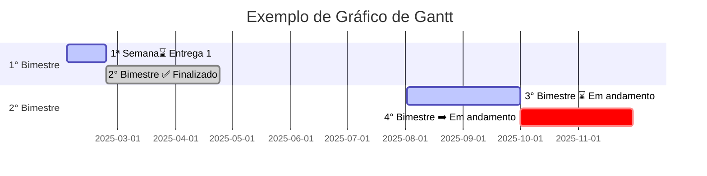
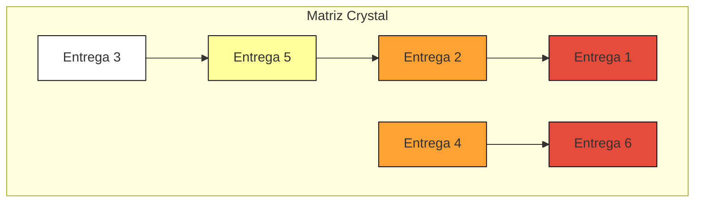

# Gantt-Crystal

```mermaid
gantt
  title Exemplo de Gráfico de Gantt
  dateFormat YYYY-MM-DD
  section 1° Bimestre
  1ª Semana⌛ Entrega 1 :active, a1, 2025-02-02, 21d
  2° Bimestre ✅ Finalizado :done, a2, after a1, 60d
  section 2° Bimestre
  3° Bimestre ⌛ Em andamento:active, a3, 2025-08-02, 60d
  4° Bimestre ➡️ Em andamento:crit, a4, after a3, 60d
  
```

```mermaid
graph TD
  subgraph Matriz Crystal
    D8["Entrega 3"]:::branco --> C20["Entrega 5"]:::amarelo --> D80["Entrega 2"]:::laranja --> D100a["Entrega 1"]:::vermelho
    D10["Entrega 4"]:::laranja --> D100b["Entrega 6"]:::vermelho

  end

classDef branco fill:#fff, stroke:#000, stroke-width:1px;
classDef amarelo fill:#FFFF99, stroke:#000, stroke-width:1px;
classDef laranja fill:#FFA233, stroke:#000, stroke-width:1px;
classDef vermelho fill:#E64C3C, stroke:#000, stroke-width:1px;


```
