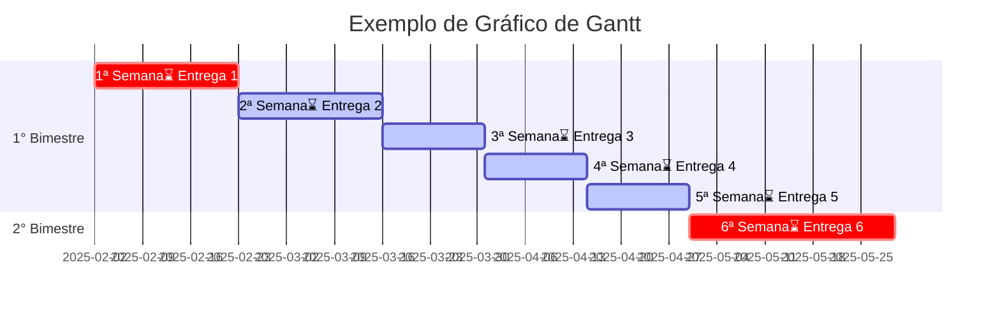
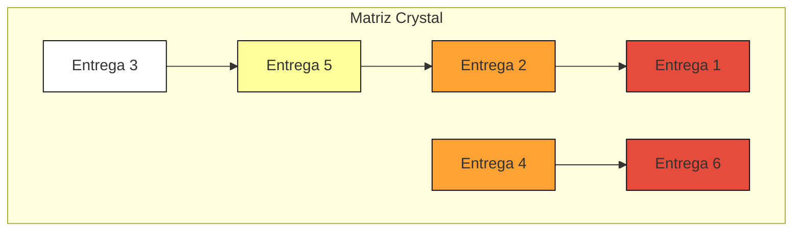

# Gantt-Crystal

```mermaid
gantt
  title Exemplo de Gráfico de Gantt
  dateFormat YYYY-MM-DD
  section 1° Bimestre
  1ª Semana⌛ Entrega 1 :crit, a1, 2025-02-02, 21d
  2ª Semana⌛ Entrega 2 :active, a2, after a1, 21d
  3ª Semana⌛ Entrega 3 :active, a3, after a2, 15d
  4ª Semana⌛ Entrega 4 :active, a4, after a3, 15d
  5ª Semana⌛ Entrega 5 :active, a5, after a4, 15d
  section 2° Bimestre
  6ª Semana⌛ Entrega 6 :crit, a6, after a5, 30d
  
```

```mermaid
graph TD
  subgraph Matriz Crystal
    D8["Entrega 3"]:::branco --> C20["Entrega 5"]:::amarelo --> D80["Entrega 2"]:::laranja --> D100a["Entrega 1"]:::vermelho
    D10["Entrega 4"]:::laranja --> D100b["Entrega 6"]:::vermelho

  end

classDef branco fill:#fff, stroke:#000, stroke-width:1px;
classDef amarelo fill:#FFFF99, stroke:#000, stroke-width:1px;
classDef laranja fill:#FFA233, stroke:#000, stroke-width:1px;
classDef vermelho fill:#E64C3C, stroke:#000, stroke-width:1px;


```
